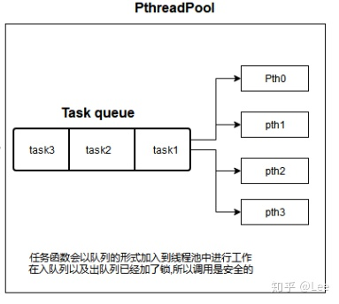

## 线程池介绍
多线程基础：[POSIX 多线程基础](https://github.com/AngryHacker/Rookie-Note/blob/master/multithreaded%20programming/README.md)。

#### 1. 线程池的概念：

线程池就是首先创建一些线程，它们的集合称为线程池。使用线程池可以很好地提高性能，线程池在系统启动时即创建大量空闲的线程，程序将一个任务传给线程池，线程池就会启动一条线程来执行这个任务，执行结束以后，该线程并不会死亡，而是再次返回线程池中成为空闲状态,在这里说是空闲状态其实是被条件变量阻塞了，等待执行下一个任务。

#### 2. 线程池的工作机制

2.1 在线程池的编程模式下，任务是提交给整个线程池，而不是直接提交给某个线程，线程池在拿到任务后，就在内部寻找是否有空闲的线程，如果有，则将任务交给某个空闲的线程。

2.1 一个线程同时只能执行一个任务，但可以同时向一个线程池提交多个任务。

#### 3. 使用线程池的原因：

多线程运行时间，系统不断的启动和关闭新线程，成本非常高，会过渡消耗系统资源，以及过渡切换线程的危险，从而可能导致系统资源的崩溃。这时，线程池就是最好的选择了。




此时这里有一个任务队列,task则是用户所指定的回调函数,将该函数以及参数放置线程池给出API,线程池在初始化就已经预先开辟了一些任务队列,此时放入任务时(队列的形式放入,先进先出),发出一个signed信号来唤醒一个wait的线程(也就是空间的线程),然后线程会从任务队列中拿走一个任务函数执行.


线程池有一个好处就是减少线程创建和销毁的时间，在任务处理时间比较短的时候这个好处非常显著，可以提升任务处理的效率。

#### 线程池实现
这里介绍的是线程池的一个简单实现，在创建的时候预先派生指定数量的线程，然后去任务队列取添加进来的任务进行处理就好。

作者说之后会添加更多特性，我们作为学习之后就以这个版本为准就好了。

项目主页：[threadpool](https://github.com/mbrossard/threadpool)

数据结构
主要有两个自定义的数据结构.
```c++
typedef struct {
    void (*function)(void *);
    void *argument;
} threadpool_task_t;
```
用于保存一个等待执行的任务。一个任务需要指明：要运行的对应函数及函数的参数。所以这里的 struct 里有函数指针和 void 指针。
```c++
struct threadpool_t {
   pthread_mutex_t lock;     /* 互斥锁 */
   pthread_cond_t notify;    /* 条件变量 */
   pthread_t *threads;       /* 线程数组的起始指针 */
   threadpool_task_t *queue; /* 任务队列数组的起始指针 */
   int thread_count;         /* 线程数量 */
   int queue_size;           /* 任务队列长度 */
   int head;                 /* 当前任务队列头 */
   int tail;                 /* 当前任务队列尾 */
   int count;                /* 当前待运行的任务数 */
   int shutdown;             /* 线程池当前状态是否关闭 */
   int started;              /* 正在运行的线程数 */
};
```
一个线程池的结构。因为是 C 语言，所以这里任务队列是用数组，并维护队列头和队列尾来实现。
### 对外接口
```cpp
threadpool_t *threadpool_create(int thread_count, int queue_size, int flags);
```
创建线程池，用 thread_count 指定派生线程数，queue_size 指定任务队列长度，flags 为保留参数，未使用。
```cpp
int threadpool_add(threadpool_t *pool, void (*routine)(void *),void *arg, int flags); 
```
添加需要执行的任务。第二个参数为对应函数指针，第三个为对应函数参数。flags 未使用。
```c++
int threadpool_destroy(threadpool_t *pool, int flags); 
```
销毁存在的线程池。flags 可以指定是立刻结束还是平和结束。立刻结束指不管任务队列是否为空，立刻结束。平和结束指等待任务队列的任务全部执行完后再结束，在这个过程中不可以添加新的任务。
内部辅助函数
```
static void *threadpool_thread(void *threadpool); 线程池每个线程所执行的函数。
int threadpool_free(threadpool_t *pool); 释放线程池所申请的内存资源。
```

#### 如何保证线程池安全?
- 尝试使用互斥锁以及条件变量
- 互斥锁:确保队列的头结点尾结点以及count计数的变量安全
- 条件变量:任务加入唤醒一个空闲的线程解锁一个互斥锁

### Reference
1. [threadpool — 基于 pthread 实现的简单线程池](https://blog.csdn.net/jcjc918/article/details/50395528)
2. [【C/C++】 Pthread线程池](https://zhuanlan.zhihu.com/p/88896082)